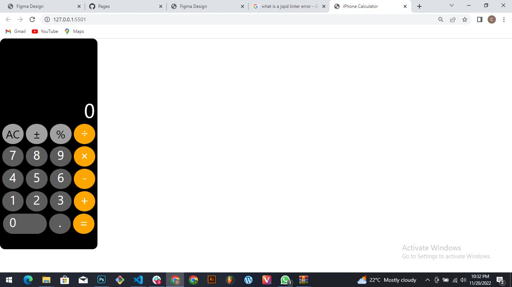

# iPhone Calculator - JavaScript

A simple calculator that perfoms basic operations with the iOS design.

## App

### Built With
- HTML
- CSS
- Javacript

### Prerequisites

Knowledge about:
Any Chromium Browser.
Perfoming Simple mathematical operations.
  
## Clone project

- To get a local copy up and running follow these simple example steps.
- Clone this repository with `https://github.com/clint360/iOS16-calculator-jsproject.git` using your terminal.
- Change to the project directory by entering: cd block in the terminal.

## steps

- $ git clone `https://github.com/clint360/iOS16-calculator-jsproject`
- $ `cd iOS16-calculator-jsproject`
- $ `git checkout feature/javascript`

## Start App

- run by opening the index.html in the browser

## Author

👤 **clint360**

- GitHub: [@clint360](https://github.com/clint360)

## 📝 License

